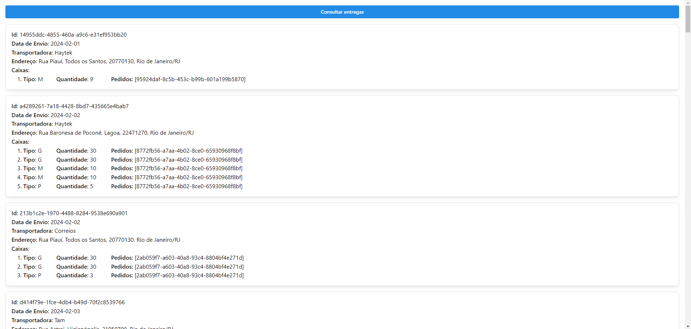

# Desafio Haytek

[Desafio técnico](https://github.com/haytek-project/test-haytek) realizado como parte do processo seletivo para desenvolvedor da Haytek.

## Tecnologias utilizadas

### Backend

- [Node.js](https://nodejs.org/en)
- [NestJS](https://nestjs.com/)
- [Typescript](https://www.typescriptlang.org/)
- [Axios](https://axios-http.com/)
- [Jest](https://jestjs.io/)
- [Vercel](https://vercel.com/)

### Frontend

- [React](https://react.dev/)
- [Typescript](https://www.typescriptlang.org/)
- [Mantine](https://mantine.dev/)
- [Vercel](https://vercel.com/)

## Configurações

Existem dois projetos neste repositório: server e client, cada um com suas configurações.

### Server

Deve-se criar um arquivo `.env` na pasta `server`, com as seguintes configurações:

- `PORT`: porta em que a aplicação será executada.
- `HAYTEK_API_URL`: URL da API fornecida pela Haytek.

Um exemplo deste arquivo `.env.example` está disponível na pasta `server`.

### Client

Deve-se criar um arquivo `.env.local` na pasta `client`, com as seguintes configurações:

- `VITE_SERVER`: URL da aplicação do projeto `server` a ser utilizada.

Um exemplo deste arquivo `.env.example` está disponível na pasta `client`.

## Como executar

Foi utilizado o `yarn` como gerenciador de pacotes, então é necessário que esteja instalado antes de prosseguir.

```bash
npm install --global yarn
```

### Server

Após configurar corretamente o arquivo `.env`, a partir da raíz do repositório:

```bash
cd server
# Instalar dependências
yarn
# Iniciar aplicação
yarn start
```

Após isso, a aplicação está executando na porta definida no arquivo `.env`, acessível através de `http://localhost:3000/shipments`.

### Client

Após configurar corretamente o arquivo `.env.local`, a partir da raíz do repositório:

```bash
cd client
# Instalar dependências
yarn
# Iniciar aplicação
yarn dev
```

Após isso, a aplicação está executando na porta `5173`, acessível através de `http://localhost:5173/`.

## Serviços

Foram criados serviços para cada uma das entidades disponibilizadas através da API da Haytek, contendo o método `findAll` para retornar os dados:

- `OrdersService`
- `AddressesService`
- `CarriersService`
- `Boxes`

Para lidar com a lógica do desafio, foram criadas duas classes:

- `ShipmentsController`: responsável por lidar com as requisições, que utiliza o `ShipmentsService`. Possui apenas um endpoint, `/shipments`, que recebe requisições `GET`.
- `ShipmentsService`: responsável pela lógica de negócio da aplicação.

A classe `ShipmentsService` utiliza os serviços anteriores para ter acesso aos dados fornecidas pela Haytek, e por sua vez possui diversos métodos:

- `computeAll`: método que inicia a lógica de negócio para retornar todas as entregas.
- `computeShippingDate`: calcula a data da entrega utilizando a data em que o pedido foi realizado, e o horário de corte da transportadora.
- `organizeOrdersInShipments`: organiza os pedidos em entregas utilizando os critérios do desafio, sem realizar a distribuição dos pedidos em caixas.
- `computeBoxesDistribution`: calcula a distribuição de caixas para uma entrega.
- `packShipmentBoxes`: utilizando a distribuição de caixas geradas, acomoda os pedidos nelas.

## Algoritmos

Para o cálculo da melhor distribuição de caixas por entrega, feito pelo método `computeBoxesDistribution`, foram feitos dois algoritmos:

- `computeBoxesDistribution`: método que está sendo utilizado por padrão, usando programação dinâmica para chegar ao melhor resultado.
- `computeBoxesDistributionGreedy`: método guloso que preenche primeiro as caixas maiores, verificando apenas se a última caixa pode ser otimizada.

Ambos os algoritmos funcionam bem para o caso proposto no desafio, que tem caixas com capacidades de 5, 10, e 30, pois elas seguem um padrão: a capacidade das caixas maiores sempre é um múltiplo da capacidade das caixas menores. Porém, ao inserir a possibilidade de uma caixa que não é múltiplo, por exemplo com capacidade 2, o algoritmo guloso não retorna o resultado ótimo. Esta diferença está documentada no teste `should give the optimal result while the greedy algorithm does not` do arquivo `shipments.service.spec.ts`.

## Testes

Foram feitos diversos testes para os métodos da classe `ShipmentsService`, além das outras classes. Para executar todos os testes, a partir da raiz do repositório:

```bash
cd server
# Instalar dependências
yarn
# Executar testes
yarn test
```

Além disso, foi configurada uma Github Action para executar os testes a cada commit na branch `main`.

## Exemplo da aplicação



## Deployment

Foi realizado o deployment de ambas as aplicações, server e client, utilizando a [Vercel](https://vercel.com/), disponíveis em https://desafio-haytek-server.vercel.app/shipments e https://desafio-haytek-client.vercel.app/ respectivamente.
